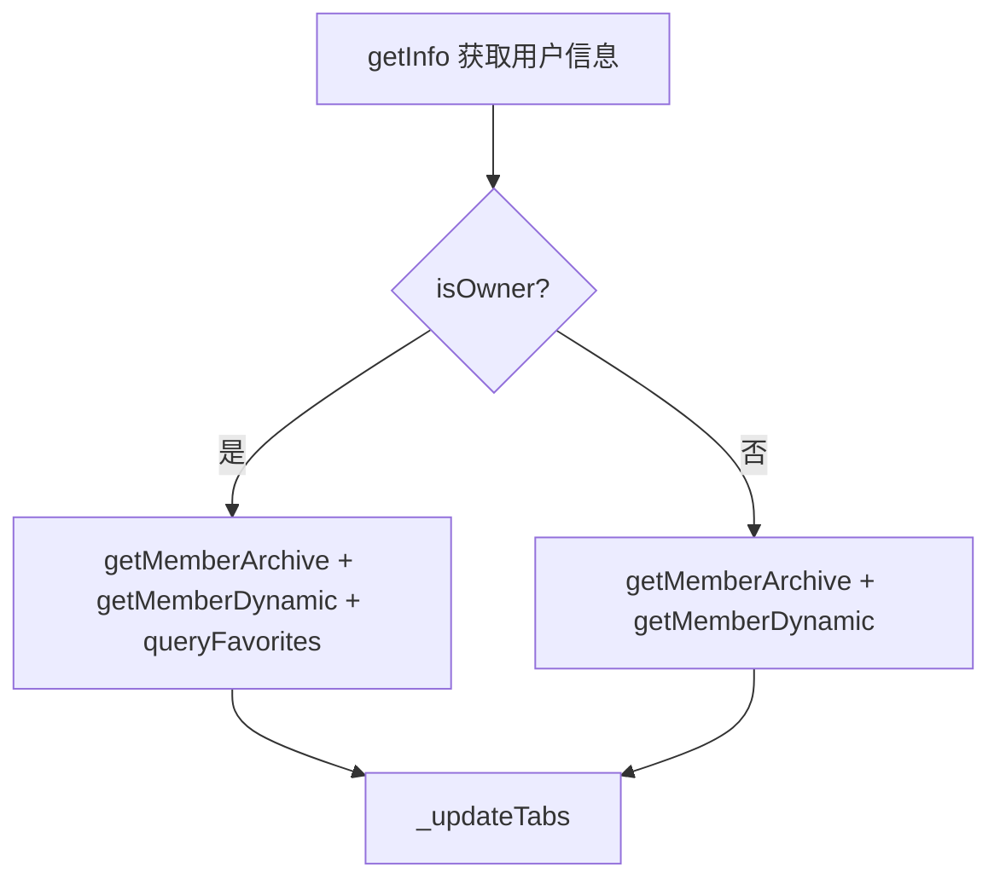

# 用户页（Member）

## 1. 模块概述（含子页面结构）

用户模块由三个独立页面组成，共同覆盖用户资料展示、视频投稿浏览和动态浏览三大场景：

| 页面 | 路由 | 说明 |
|------|------|------|
| `MemberPage` | `/member?mid={mid}` | 用户主页：头像 + 信息 + Tab（视频 / 动态 / 收藏） |
| `MemberArchivePage` | `/memberArchives?mid={mid}` | 用户投稿列表：支持排序切换的独立列表页 |
| `MemberDynamicsPage` | `/memberDynamics?mid={mid}` | 用户动态列表：支持滚动分页的独立动态页 |

### 文件结构

```
lib/pages/member/
├── controller.dart            # MemberController - 用户主页控制器
├── view.dart                  # MemberPage - 用户主页 UI
├── index.dart                 # 模块统一导出
└── widgets/
    ├── profile.dart           # ProfilePanel - 带头像 + 关注/粉丝统计 + 操作按钮的用户信息卡片
    └── profile_design.dart    # ProfileDesign - 带 Banner 的完整 Profile 设计（独立设计组件）

lib/pages/member_archive/
├── controller.dart            # MemberArchiveController - 投稿列表控制器
└── view.dart                  # MemberArchivePage - 投稿列表页

lib/pages/member_dynamics/
├── controller.dart            # MemberDynamicsController - 动态列表控制器
└── view.dart                  # MemberDynamicsPage - 动态列表页
```

### 依赖关系

```
MemberPage (view.dart)
  ├── Get.put → MemberController (controller.dart, tag: heroTag)
  ├── Get.put → MemberDynamicsController (controller.dart, tag: heroTag)
  ├── Get.put → FavController (来自 lib/pages/fav/, tag: heroTag)
  ├── IUserRepository → getUserDetail / followUser / blockUser / getFollowStatus
  ├── IVideoRepository → getUserVideoList
  ├── IDynamicsRepository → getUserBlogs
  ├── NestedScrollView + SliverAppBar + TabBar + TabBarView
  └── 子 Tab: _VideoTabPage / _DynamicsTabPage / _FavoriteTabPage

MemberArchivePage (view.dart)
  ├── Get.put → MemberArchiveController (tag: heroTag)
  └── IVideoRepository → getUserVideoList

MemberDynamicsPage (view.dart)
  ├── Get.put → MemberDynamicsController (tag: heroTag)
  └── IDynamicsRepository → getUserBlogs
```

### 路由入口

跳转示例：

```dart
// 进入用户主页
Get.toNamed('/member', parameters: {'mid': '12345'}, arguments: {
  'face': 'https://...',
  'heroTag': 'member-12345',
});

// 进入用户投稿列表
Get.toNamed('/memberArchives', parameters: {'mid': '12345'});

// 进入用户动态列表
Get.toNamed('/memberDynamics', parameters: {'mid': '12345'});
```

---

## 2. MemberController 详解

**源文件：** `controller.dart`

`MemberController` 继承自 `GetxController`，管理用户主页的核心业务逻辑，包括用户信息查询、关注状态、视频列表和分享等功能。

### 2.1 依赖

| 依赖 | 来源 | 说明 |
|------|------|------|
| `IUserRepository` | `Get.find<IUserRepository>()` | 用户仓储接口，获取用户详情 / 关注状态 / 关注用户 / 黑名单操作 |
| `IVideoRepository` | `Get.find<IVideoRepository>()` | 视频仓储接口，获取用户投稿列表 |
| `GStrorage.userInfo` | Hive Box | 用户信息缓存，判断当前登录用户身份 |

### 2.2 核心属性

| 属性 | 类型 | 说明 |
|------|------|------|
| `mid` | `int` | 目标用户 ID，从路由参数 `Get.parameters['mid']` 解析 |
| `memberInfo` | `Rx<MemberInfoModel>` | 用户详情数据（响应式），包含 name / face / fans / attention / cover 等 |
| `face` | `RxString` | 用户头像 URL（响应式） |
| `heroTag` | `String?` | Hero 动画标签 |
| `isOwner` | `RxBool` | 是否为当前登录用户本人 |
| `ownerMid` | `int` | 当前登录用户 ID，若未登录则为 -1 |
| `archiveList` | `RxList<VListItemModel>` | 用户视频投稿列表（响应式） |
| `isLoadingArchive` | `RxBool` | 投稿列表加载状态 |
| `attribute` | `RxInt` | 关注状态码：`0` = 未关注，`2` = 已关注，`128` = 已拉黑，`-1` = 未知 |
| `attributeText` | `RxString` | 关注按钮文案："关注" / "已关注" / "已拉黑" |
| `crossAxisCount` | `RxInt` | 响应式网格列数（由 `ResponsiveUtil` 计算） |
| `userInfo` | `dynamic` | 当前登录用户的缓存信息，未登录时为 `null` |

### 2.3 核心方法

#### `onInit()`
初始化路由参数 `mid`、读取当前用户信息、判断 `isOwner`、设置头像 `face` 和 `heroTag`，并自动调用 `updateCrossAxisCount()` 和 `relationSearch()`。

#### `getInfo() → Future<Map<String, dynamic>>`
调用 `_userRepo.getUserDetail(uid: mid)` 获取用户详情，更新 `memberInfo` 和 `face`。返回 `{'status': 'success'}` 或 `{'status': 'fail', 'message': ...}`。

#### `getMemberArchive(String type)`
调用 `_videoRepo.getUserVideoList(uid: mid, offset: ..., num: 20)` 加载视频列表。`type == 'init'` 时清空并重新加载，`type == 'onLoad'` 时追加加载。带有防重复加载保护。

#### `getMemberStat()` / `getMemberView()`
预留接口，当前返回空数据。

#### `actionRelationMod()`
关注操作入口。未登录时提示登录；若已拉黑则跳转到 `blockUser()`；否则弹窗确认关注 / 取消关注，调用 `_userRepo.followUser(followingUid: mid)`。

#### `relationSearch()`
查询当前用户与目标用户的关系状态。仅在已登录且非本人时执行，调用 `_userRepo.getFollowStatus()` 获取关注状态并更新 `attribute`。

#### `blockUser()`
拉黑 / 移除黑名单操作。弹窗确认后调用 `_userRepo.blockUser(blockedId: mid)` 或 `_userRepo.unblockUser(blockedId: mid)`。

#### `shareUser()`
调用 `SharePlus.instance.share()` 分享用户链接（`https://www.ottohub.cn/u/$mid`）。

---

## 3. MemberView 详解（Profile 组件树）

**源文件：** `view.dart`

`MemberPage` 是一个 `StatefulWidget`，混合了 `TickerProviderStateMixin`（支持 TabController）和 `ScrollToTopMixin`。

### 3.1 加载状态

页面通过 `FutureBuilder` 管理三种状态：

- **Loading** → `_buildLoadingScaffold()`：AppBar + 居中 CircularProgressIndicator
- **Error** → `_buildErrorScaffold()`：错误图标 + 错误提示 + 重试按钮
- **Content** → `_buildContentScaffold()`：正常内容

### 3.2 _initData 初始化流程



`_updateTabs()` 根据各列表是否为空动态构建 Tab：
- 有视频 → 添加"视频" Tab
- 有动态 → 添加"动态" Tab
- 有收藏且本人 → 添加"收藏" Tab

### 3.3 页面结构

```
Scaffold
└── NestedScrollView
    ├── headerSliverBuilder:
    │   ├── SliverAppBar (expandedHeight: 280, pinned + snap)
    │   │   ├── leading: 返回按钮
    │   │   ├── title: 滚动渐显的 头像 + 用户名 + UID
    │   │   ├── actions: 私信 + 搜索 + PopupMenuButton (黑名单/分享)
    │   │   └── flexibleSpace: 背景图 + 用户信息区
    │   │       ├── Stack
    │   │       │   ├── CachedNetworkImage (封面背景)
    │   │       │   ├── 半透明遮罩
    │   │       │   ├── SafeArea
    │   │       │   │   ├── 头像 (70px, 圆形带边框)
    │   │       │   │   ├── 用户名 + UID + 关注/粉丝统计
    │   │       │   │   └── Positioned [关注按钮 / 发消息] (非本人)
    │   │       │   └── /SafeArea
    │   │       └── /Stack
    │   └── SliverPersistentHeader (pinned)
    │       └── TabBar (scrollable)
    └── body: TabBarView
        ├── _VideoTabPage → GridView.builder + VideoCardH
        ├── _DynamicsTabPage → ListView.builder + DynamicPanel
        └── _FavoriteTabPage → GridView.builder + VideoCardH
```

### 3.4 子 Tab 页面

#### _VideoTabPage
- 使用 `AutomaticKeepAliveClientMixin` 保持状态
- 通过 `Get.find<MemberController>(tag: heroTag)` 获取控制器
- 加载中显示 `VideoCardHSkeleton` 骨架屏（10 个）
- 空数据时显示 `NoData`
- 正常渲染 `VideoCardH`（`showOwner: false, showPubdate: true`）
- 响应式网格列数由 `crossAxisCount` 控制

#### _DynamicsTabPage
- 宽屏模式下居中显示（最大宽度 600px）
- 使用 `MemberDynamicsController` 的 `scrollController` 实现滚动
- 通过 `DynamicPanel` 渲染动态卡片
- 点击跳转 `/dynamicDetail` 详情页

#### _FavoriteTabPage
- 仅本人可见
- 使用 `FavController` 的数据和滚动控制器
- 同样使用 `VideoCardH` 展示收藏视频

### 3.5 操作按钮

| 操作 | 条件 | 行为 |
|------|------|------|
| 关注 / 已关注 | 非本人 + 窄屏 | `FilledButton`，调用 `actionRelationMod()` |
| 关注 + 发消息 | 非本人 + 宽屏 | 两个按钮：关注 + 发私信 |
| 发私信 | 非本人 | 跳转 `/message` 路由 |
| 搜索 | 有用户名时 | 跳转 `/memberSearch` |
| 更多菜单 | 有用户名时 | PopupMenu：黑名单 + 分享 |
| 编辑资料 | 本人 | 开发中（Toast 提示） |

### 3.6 Profile 组件

#### ProfilePanel (`widgets/profile.dart`)
- 用于旧版样式的用户信息卡片
- 包含：Hero 头像 (80px) + 关注/粉丝/获赞统计 + 关注按钮 + 发消息按钮
- 通过 `ctr` 参数传入 `MemberController` 实例
- 关注和粉丝点击跳转 `/follow` 和 `/fan` 路由

#### ProfileDesign (`widgets/profile_design.dart`)
- 独立的完整 Profile 设计组件，使用 `CustomScrollView`
- 包含：Banner 背景图 + 头像 (90px) + 显示名 + @用户名 + 徽章角色 + 个人简介 + 统计
- 支持登录/未登录两种状态
- 提供 `BadgeRole` 和 `UserStats` 辅助数据类

---

## 4. MemberArchive Page 详解

**源文件：** `controller.dart` | `view.dart`

### 4.1 MemberArchiveController

| 属性 | 类型 | 说明 |
|------|------|------|
| `mid` | `int` | 目标用户 ID |
| `offset` | `int` | 分页偏移量 |
| `count` | `int` | 本次加载的数据量 |
| `currentOrder` | `RxMap<String, String>` | 当前排序方式 |
| `orderList` | `RxList<Map>` | 排序选项：最新发布 / 最多播放 / 最多收藏 |
| `archivesList` | `RxList<VListItemModel>` | 投稿视频列表 |
| `isLoading` | `RxBool` | 加载状态 |

方法：

- **`getMemberArchive(String type)`**：`init` 清空重载，`onLoad` 追加；调用 `_videoRepo.getUserVideoList(uid, offset, num: 20)`
- **`toggleSort()`**：循环切换排序方式并重新加载
- **`onLoad()`**：上拉加载更多

### 4.2 MemberArchivePage

- AppBar 标题格式：`他的投稿 - {当前排序标签}`
- 通过 PopupMenuButton 切换排序
- 使用 `CustomScrollView` + `SliverList` + `FutureBuilder`
- 滚动监听：距底部 200px 时通过 `EasyThrottle` 防抖触发 `onLoad()`
- 渲染 `VideoCardH`（`showOwner: false, showPubdate: true, showCharge: true`）
- 抛错误时展示 `HttpError` 组件

---

## 5. MemberDynamics Page 详解

**源文件：** `controller.dart` | `view.dart`

### 5.1 MemberDynamicsController

| 属性 | 类型 | 说明 |
|------|------|------|
| `mid` | `int` | 目标用户 ID |
| `offset` | `int` | 分页偏移量 |
| `count` | `int` | 已加载总条数 |
| `hasMore` | `bool` | 是否还有更多数据（每页 10 条，不足 10 条时置为 false） |
| `dynamicsList` | `RxList<DynamicItemModel>` | 动态列表 |
| `isLoading` | `RxBool` | 加载状态 |

方法：

- **`getMemberDynamic(String type)`**：`onRefresh` 清空重载，`onLoad` 追加；调用 `_dynamicsRepo.getUserBlogs(uid, offset, num: 10)`；返回 `{'status': 'success'}` 或 `{'status': 'fail'}`
- **`onLoad()`**：上拉加载更多

### 5.2 MemberDynamicsPage

- AppBar 标题：`他的动态`
- `FutureBuilder` 管理加载 / 成功 / 失败三种状态
- 成功状态下使用 `ListView.builder` + `Obx` 渲染动态
- 滚动监听：距底部 200px 时通过 `EasyThrottle` 防抖（1000ms）触发 `onLoad()`
- 宽屏模式下居中显示（最大宽度 600px）
- 每个动态使用 `DynamicPanel`，点击跳转 `/dynamicDetail`

---

## 6. 数据流

```
                    ┌─────────────────────┐
                    │   路由 /member?mid=  │
                    │   arguments: {face}  │
                    └──────────┬──────────┘
                               │
                    ┌──────────▼──────────┐
                    │  MemberPage.onInit  │
                    │  Get.put(controller)│
                    └──────────┬──────────┘
                               │
              ┌────────────────┼────────────────┐
              ▼                ▼                ▼
  ┌─────────────────┐ ┌──────────────┐ ┌──────────────┐
  │ IUserRepository │ │IVideoRepo    │ │IDynamicsRepo │
  │ getUserDetail() │ │getUserVideo  │ │getUserBlogs()│
  │ getFollowStatus │ │ List()       │ │              │
  │ followUser()    │ │              │ │              │
  │ blockUser()     │ │              │ │              │
  └────────┬────────┘ └──────┬───────┘ └──────┬───────┘
           │                 │                │
           ▼                 ▼                ▼
  ┌──────────────────────────────────────────────────┐
  │              MemberPage (NestedScrollView)        │
  │  ┌──────────────┐ ┌──────────┐ ┌──────────────┐ │
  │  │ _VideoTabPage │ │_Dynamics │ │_FavoriteTab  │ │
  │  │ VideoCardH    │ │ TabPage  │ │ Page         │ │
  │  └──────────────┘ └──────────┘ └──────────────┘ │
  └──────────────────────────────────────────────────┘
```

数据存储：
- **用户信息** → `MemberController.memberInfo` (Rx)
- **视频列表** → `MemberController.archiveList` (RxList)
- **动态列表** → `MemberDynamicsController.dynamicsList` (RxList)
- **收藏列表** → `FavController.favoriteList` (RxList)
- **关注状态** → `MemberController.attribute` (RxInt)
- **用户缓存** → `GStrorage.userInfo` (Hive Box)

---

## 7. 开发指南

### 7.1 添加新的 Profile 信息字段

1. 在 `MemberInfoModel` 中添加字段定义（`lib/ottohub/models/member/info.dart`）
2. 在 `MemberController.getInfo()` 中确认 API 返回包含该字段
3. 在 `MemberView._buildUserDetails()` 中添加对应的 UI 展示

### 7.2 添加新的用户 Tab

1. 在 `MemberView._updateTabs()` 的 `newTabs` 列表中添加 Tab 名称
2. 在 `_buildTabPages()` 中返回对应的 Tab 页面 Widget
3. 如果需要新的数据源，在 `_initData()` 中添加对应的加载调用

### 7.3 响应式布局

- 网格列数通过 `ResponsiveUtil.calculateCrossAxisCount()` 动态计算
- 动态列表在宽屏下（`ResponsiveUtil.isLg || ResponsiveUtil.isXl`）居中显示，最大宽度 600px
- 窄屏（< 600px）下操作按钮仅显示"关注"，宽屏同时显示"关注"和"发消息"

### 7.4 Controller 获取方式

三个控制器均使用带 `tag` 的 GetX 注册，确保同一用户多次进入时不冲突：

```dart
final String heroTag = Utils.makeHeroTag(mid);
_memberController = Get.put(MemberController(), tag: heroTag);
_dynamicsController = Get.put(MemberDynamicsController(), tag: heroTag);
_favController = Get.put(FavController(), tag: heroTag);
```

获取时同样需要 `tag`：

```dart
_controller = Get.find<MemberController>(tag: widget.heroTag);
```

---

## 8. 二改指南

### 8.1 常见需求

#### 修改关注按钮样式
在 `MemberView._buildActionButtons()` 中调整 `FilledButton` 的样式。关注状态文案由 `_memberController.attributeText` 控制，关注状态码由 `_memberController.attribute` 控制。

#### 添加"获赞数"统计
当前 `_buildStatItem` 已渲染"关注"和"粉丝"。如需添加"获赞数"，在 `_buildUserDetails()` 的 `Row` 中添加第三个 `_buildStatItem`，数据来源需在 `MemberInfoModel` 添加对应字段。

#### 修改 Tab 数量 / 顺序
在 `view.dart` 的 `_updateTabs()` 中调整 `newTabs` 的构建逻辑。对应 `_buildTabPages()` 中同步修改 Tab 页面列表。

#### 修改分页每页数量
- 视频：`MemberController.getMemberArchive()` 中的 `num: 20`
- 动态：`MemberDynamicsController.getMemberDynamic()` 中的 `num: 10`

#### 修改滚动触发阈值
- `MemberArchivePage`：`scrollController.position.maxScrollExtent - 200`
- `MemberDynamicsPage`：`scrollController.position.maxScrollExtent - 200`

#### 自定义 Profile 组件
如需替换 `MemberView` 中的 Profile 区域布局，修改 `_buildHeaderWithUserInfo()` 方法。当前有两个可选的 Profile 组件：
- **旧版** → `profile.dart` (ProfilePanel)
- **设计版** → `profile_design.dart` (ProfileDesign)

### 8.2 注意事项

- `isOwner` 的判断依赖 `GStrorage.userInfo` 中的缓存数据，未登录时 `ownerMid = -1`
- 关注 / 拉黑操作均需要登录态，未登录会 Toast 提示
- `MemberArchivePage` 和 `MemberDynamicsPage` 是独立路由页面，不与 `MemberPage` 共享 `ScrollController`
- 宽屏布局的居中逻辑使用 `ResponsiveUtil.isLg / isXl` 判断，修改断点需在 `ResponsiveUtil` 中调整